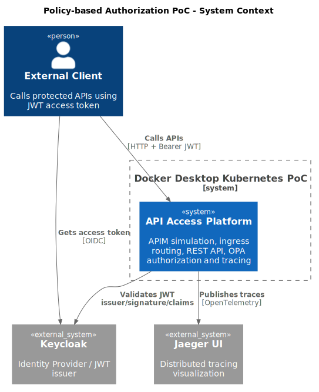
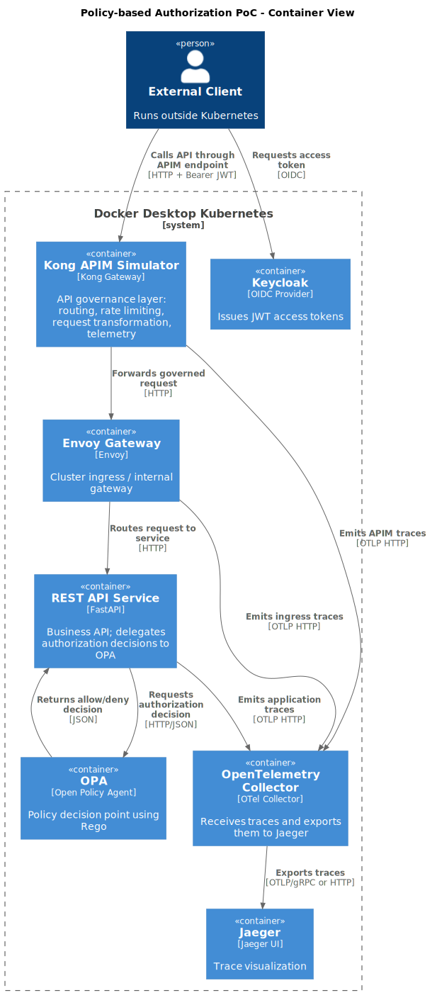

# Policy-Based API Access Control PoC

APIM (Kong) + Envoy Gateway + Keycloak + OPA with end-to-end distributed tracing.

This project demonstrates a policy-based API access control architecture using a layered API platform approach.

It validates how API access can be governed, authenticated, and authorized through distinct layers:

- API Management (APIM simulation using Kong)
- Gateway / ingress routing (Envoy)
- Identity provider (Keycloak)
- Policy-based authorization (OPA)
- End-to-end observability (OpenTelemetry + Jaeger)

The PoC proves that authorization logic can be fully externalized from application services and enforced through a centralized policy engine.

```text
External Client -> APIM Layer -> Ingress Layer -> Service Layer -> Policy Layer
                   Kong          Envoy           FastAPI          OPA
```

Runtime flow:

```text
External client -> Kong APIM simulator -> Envoy gateway -> FastAPI REST API
                                                  |
                                                  +-> OPA authorization
                                                  |
                                                  +-> OpenTelemetry Collector -> Jaeger
```

Keycloak issues JWT access tokens. Kong represents the API Management governance layer that can later be replaced by Azure APIM. Envoy validates JWTs and calls OPA through Envoy's external authorization API. The REST API contains no role or customer authorization rules.

## What This PoC Proves

- Policy-based authorization can replace hardcoded access control in services
- API governance can be separated from application logic
- Authorization decisions can be changed without redeploying services
- Immediate access revocation is possible via policy updates
- Full request flow can be observed through distributed tracing

## Architectural Layers

- **APIM Layer**: Kong (API governance, routing, policies)
- **Ingress Layer**: Envoy Gateway
- **Service Layer**: REST API
- **Authorization Layer**: OPA (policy engine)
- **Identity Layer**: Keycloak (JWT issuer)
- **Observability Layer**: OpenTelemetry + Jaeger

## Design Principle

Authorization is fully externalized from application services.

The REST API does not contain any authorization logic. All access decisions are evaluated dynamically by OPA based on request context and policies.

## Why Not Service-Based Authorization

Traditional approaches embed authorization logic inside services.

This leads to:

- duplicated logic
- difficult policy changes
- delayed access revocation

This PoC demonstrates how policy-based authorization avoids these issues.

## Architecture Diagrams

The diagrams separate the major responsibilities into APIM, ingress, service, and policy layers.

### C4 System Context



### C4 Container



## Prerequisites

- Docker Desktop with Kubernetes enabled
- `kubectl`
- Docker CLI
- Python 3, or Docker for the fallback client runner
- `make` or PowerShell

## Run

```powershell
make deploy
make test
make clean
```

PowerShell equivalents:

```powershell
.\scripts\deploy.ps1
.\scripts\test.ps1
.\scripts\clean.ps1
```

`deploy` builds the local FastAPI image, applies all Kubernetes manifests, and waits for Keycloak, Kong, OPA, Envoy, observability, and the app to become available.

`test` opens local port forwards:

- Keycloak: `http://localhost:8031`
- APIM Simulator / Kong: `http://localhost:10000`
- Envoy gateway debug endpoint: `http://localhost:10080`
- OpenTelemetry Collector HTTP OTLP: `http://localhost:4318`
- Jaeger UI: `http://localhost:16686`

Then it runs `client/client.py`. The client calls only Kong on `localhost:10000`; direct Envoy access is kept only for internal debugging.

## Expected Test Output

```text
GET /health                                  -> 200 trace_id=...
GET /customers/CUST-001/accounts             -> 200 trace_id=...
GET /customers/CUST-002/accounts             -> 403 trace_id=...
GET /admin/customers as user1                -> 403 trace_id=...
GET /admin/customers as admin                -> 200 trace_id=...
GET /customers/CUST-001/accounts no token    -> 401 trace_id=...
```

## Trace Inspection

`make test` prints a trace id for each scenario. The script keeps the Jaeger port-forward open after the test so you can inspect traces at `http://localhost:16686`.

If Jaeger is not already open, start it manually:

```powershell
kubectl port-forward svc/jaeger 16686:16686 -n observability
```

Then open [Jaeger](http://localhost:16686).

To close the leftover Jaeger port-forward later:

```powershell
Get-CimInstance Win32_Process -Filter "name = 'kubectl.exe'" |
  Where-Object { $_.CommandLine -like '*svc/jaeger*16686*' } |
  ForEach-Object { Stop-Process -Id $_.ProcessId -Force }
```

Use one of the printed `trace_id` values:

1. Paste the trace id into the Jaeger search box.
2. Open the trace.
3. For allowed requests, inspect `external-client`, `rest-api`, `JWT Validation Context`, `OPA Authorization Decision`, and `Business Handler Execution` spans.
4. Inspect `kong-apim`, `envoy-gateway`, and `opa-service` spans to see the APIM, ingress, and authorization layers.
5. For requests denied at Envoy, inspect the client, Kong, and Envoy spans. Those requests do not reach FastAPI because OPA enforcement happens at the gateway.

The REST API emits attributes such as `http.method`, `http.route`, `http.status_code`, `enduser.id`, `user.role`, `customer.id`, `opa.decision`, `opa.policy`, and `authorization.result`.

Kong and Envoy also emit OpenTelemetry spans to the same collector, so Jaeger shows the APIM simulator and cluster ingress layers in addition to the REST API spans.

Each request is traced across all layers:

```text
External Client -> APIM -> Gateway -> Service -> OPA -> Response
```

## Example Traces

### User Accesses Own Customer Account

`user1` calls `GET /customers/CUST-001/accounts` and OPA allows the request. The trace shows the full path through `external-client`, `kong-apim`, `envoy-gateway`, `opa-service`, and `rest-api`.


### User Access Denied

`user1` calls `GET /customers/CUST-002/accounts` and OPA denies the request. The trace stops at the gateway authorization path and does not include the REST API, because the request is blocked before business logic runs.


### Admin Access Allowed

`admin` calls `GET /admin/customers` and OPA allows the request. The trace includes APIM, ingress, OPA, and REST API spans.


## Test Users

Realm: `poc`

Client: `poc-client`

| User | Password | Roles | Customer |
| --- | --- | --- | --- |
| `user1` | `password` | `user` | `CUST-001` |
| `admin` | `password` | `admin` | `ADMIN` |

## Authorization Model

OPA is the source of authorization rules:

- `/health` is public.
- `role=user` can read only `/customers/{customer_id}/accounts` for their own `customer_id`.
- `role=admin` can read all customers and `/admin/customers`.

The REST API returns mock business data only. It does not decide who is allowed to see that data.

## Policy Modularity

OPA is used as a centralized Policy Decision Point, but the authorization rules are not implemented as a single monolithic policy.

Policies are split by domain:

- `common.rego`: shared request parsing, JWT extraction, roles and helper rules
- `health.rego`: health endpoint access
- `customers.rego`: customer account access policies
- `admin.rego`: administrative customer access policies

This demonstrates that policy-based authorization can be centralized at the enforcement/decision level while still keeping policy ownership modular and domain-oriented.

Centralized authorization does not require centralized policy ownership.

Each domain can maintain its own policy module, while OPA provides a consistent decision runtime.

## APIM Simulation Layer

Kong runs in the `apim` namespace as the local API Management simulation layer.

| Layer | PoC Component | Production Equivalent |
| --- | --- | --- |
| APIM governance | Kong Gateway | Azure APIM |
| Cluster ingress | Envoy | Envoy Gateway / AKS ingress |
| AuthN | Keycloak token, enforced at Envoy | Entra ID / Keycloak |
| AuthZ | OPA | OPA |
| Observability | OpenTelemetry + Jaeger | Azure Monitor / App Insights / Grafana |

Kong is configured in DB-less mode and forwards traffic to Envoy inside the cluster. It also applies a simple rate-limit policy and adds APIM marker headers. JWT validation remains at Envoy in this local implementation because Kong OSS does not provide the same simple JWKS-based OIDC validation path as Azure APIM or Envoy.

Acceptance rule: the external client must call only the APIM simulator endpoint, `http://localhost:10000`. Direct Envoy calls on `http://localhost:10080` are for debugging only and are not used by the test client.

## Azure APIM Mapping

Kong is used as a local APIM simulation.

In production, this layer maps directly to Azure API Management.

Azure APIM can replace Kong while keeping the same service model:

1. APIM validates the Keycloak or federated token.
2. APIM applies API-level policies and forwards to the cluster ingress.
3. Envoy routes to internal Kubernetes services and integrates with OPA.
4. OPA evaluates policy for every protected request.
5. The REST API executes business logic without embedded authorization rules.

No secondary token is issued after customer validation. The original validated identity and customer context is evaluated by OPA on each request.

See [docs/architecture.md](docs/architecture.md) and [docs/test-scenarios.md](docs/test-scenarios.md).
