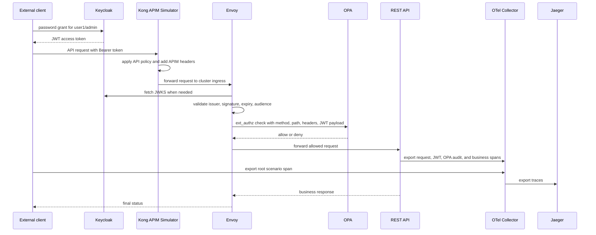

# Architecture

## Components

- Keycloak runs in the `identity` namespace and imports the `poc` realm at startup.
- Kong runs in the `apim` namespace and simulates the API Management layer.
- Envoy runs in the `gateway` namespace as the internal cluster ingress behind Kong.
- OPA runs in the `authorization` namespace with the Envoy external authorization gRPC plugin enabled.
- FastAPI runs in the `app` namespace and exposes only business endpoints.
- OpenTelemetry Collector and Jaeger run in the `observability` namespace.
- The client runs outside Kubernetes and calls Keycloak plus Envoy through local port forwards.

## Request Flow



## Why OPA Owns Authorization

The REST API does not inspect roles or customer ownership to decide access. OPA evaluates those rules from `opa/policy.rego`, mounted into Kubernetes as `opa-policy`.

This keeps the later Azure APIM design stable. APIM can replace Envoy as the gateway that validates token context and invokes OPA or an equivalent policy decision point, while the REST API remains unchanged.

## APIM Simulation

The external client calls Kong on `localhost:10000`. Kong forwards to the Envoy service inside Kubernetes:

```text
client.py -> localhost:10000 -> Kong -> envoy.gateway.svc.cluster.local -> REST API -> OPA
```

Envoy remains available on `localhost:10080` only for debugging. The test client does not use it.

Kong DB-less configuration applies a simple rate-limit policy and enriches requests with APIM marker headers. JWT validation remains enforced at Envoy for the local PoC; in production, Azure APIM can take over or share token validation depending on the target design.

## Tracing

The external client starts a trace for each test scenario and injects W3C trace context into the request through Kong and Envoy. The REST API continues that trace for allowed requests and emits spans for:

- incoming HTTP request
- decoded JWT context from Envoy
- OPA authorization decision audit
- business handler execution

Kong, Envoy, and OPA export OpenTelemetry spans to the collector. Denied requests stop at Envoy by design, so FastAPI cannot emit spans for those requests; Jaeger still shows the client, Kong, Envoy, and OPA authorization layers for those denied calls.

## No Secondary Token

The PoC deliberately does not issue a second token after customer validation. The original Keycloak access token is validated at the gateway, and OPA evaluates the request context on every protected request.
